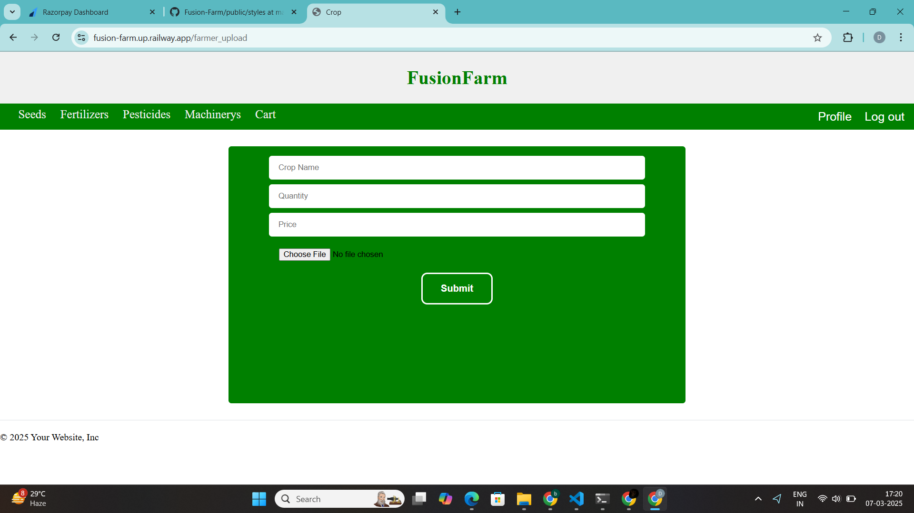

# FUSIONFARM

## Project Overview
FUSIONFARM is a multi-vendor online delivery system designed to connect farmers, Agriculture Resource Dealer (ARD), Agriculture Machine Dealer (AMD) and customers, facilitating seamless transactions for agricultural products. The platform provides dashboards for all four customers, ARD, AMD and farmers, ensuring an efficient and user-friendly experience.

## Features
- Multi-vendor support for sellers (farmers) and buyers (customers)
- Secure payment integration
- User authentication and profile management
- Product upload and order management
- Interactive dashboards for farmers, ARD, AMD and customers
- Cart and checkout functionality

## Directory Structure
```
FUSIONFARM/
│-- controllers/
│-- data/
│-- node_modules/
│-- public/
│-- routes/
│-- screenshots/
│-- views/
│-- .gitignore
│-- index.js
│-- package.json
│-- package-lock.json
│-- README.md
```

## Screenshots
Here are some screenshots of the platform:

### Cart Page


### Customer Dashboard


### Customer Vegetable Page


### Main Dashboard


### Farmer Dashboard


### Farmer Seeds Page


### Login Page


### Profile Update Page


### Profile Page


### Registration Page


### Upload Page


## Installation & Setup

### Prerequisites
Ensure you have the following installed on your system:
- Node.js
- npm (Node Package Manager)
- A database system (MySQL/PostgreSQL)

### Steps to Set Up the Project
1. Clone the repository:
   ```bash
   git clone https://github.com/bodadevraj30/Fusion-Farm.git
   ```
2. Navigate to the project directory:
   ```bash
   cd FUSIONFARM
   ```
3. Install dependencies:
   ```bash
   npm install
   ```
4. Configure the database:
   - Ensure the database credentials match those in `database.js`.
   - Run the SQL script to set up the tables:
     ```bash
     mysql -u your_user -p your_database < data/db.sql
     ```
5. Start the server:
   ```bash
   npm start
   ```
6. Open the application in your browser:
   ```
   http://localhost:3000
   ```

## Contributing
Contributions are welcome! Please fork the repository and submit a pull request.

## License
This project is licensed under the MIT License.

---
